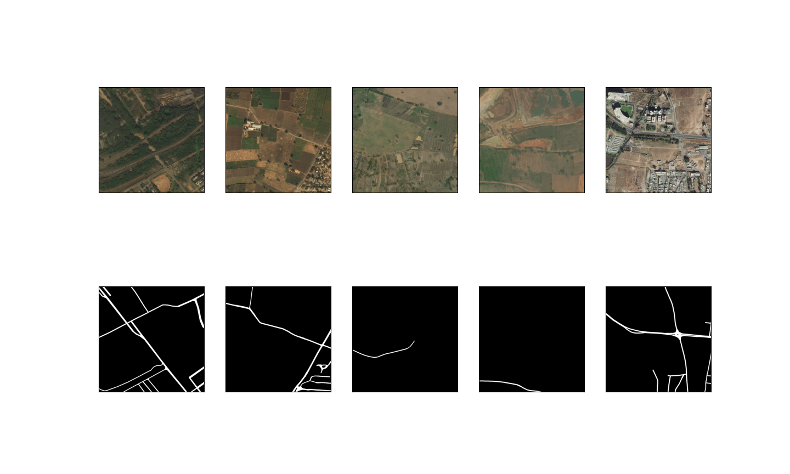
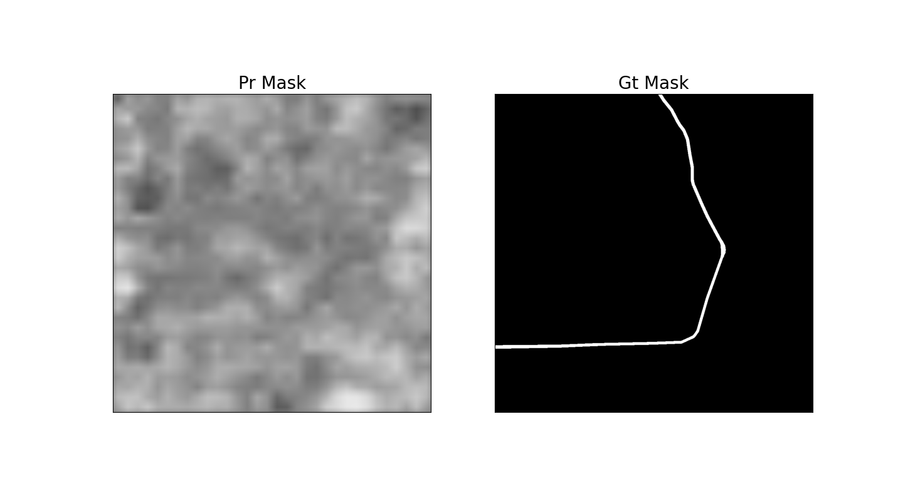
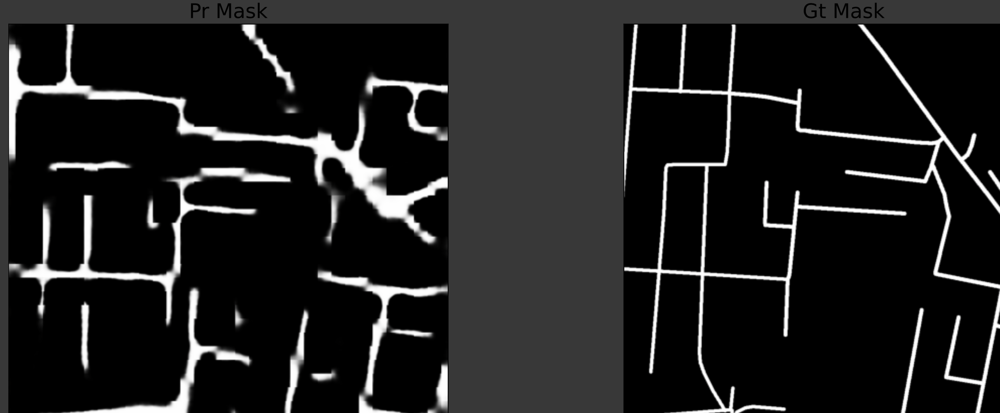
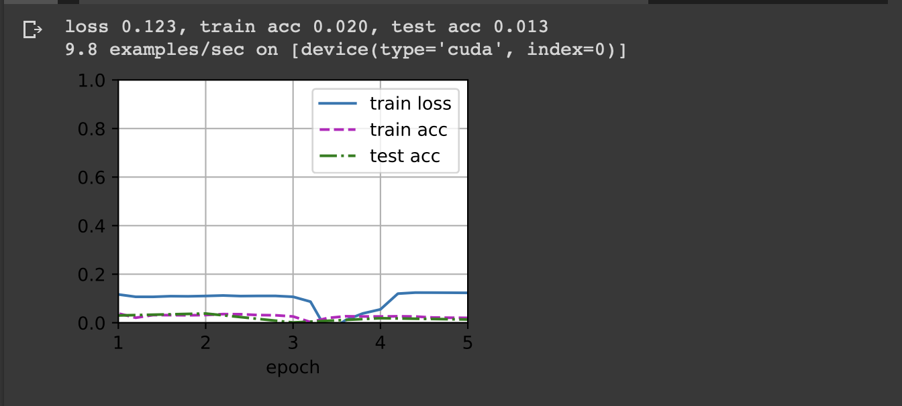
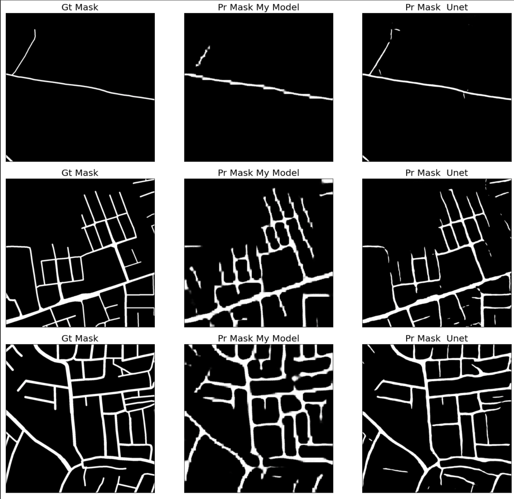
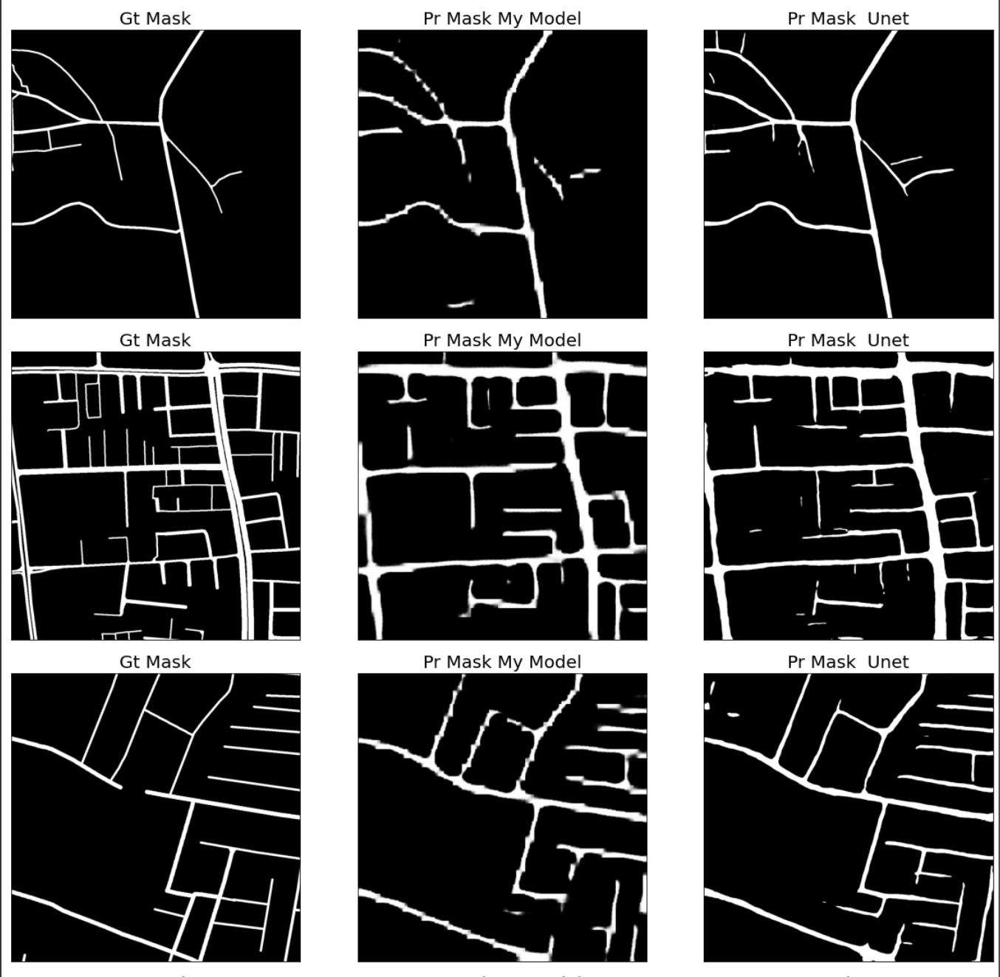
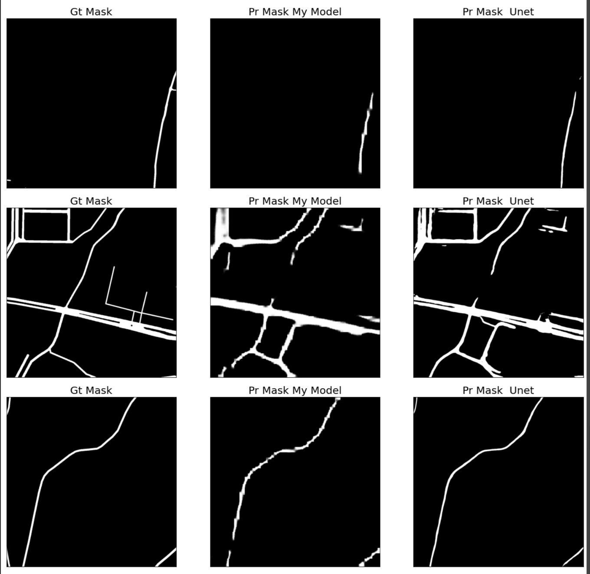

# DeepGlobe Road Extraction from Satellite Imagery - A hands-on attempt

<!-- ABOUT THE PROJECT -->
## About The Project

This project uses [DeepGlobe Road Extraction Challenge](https://competitions.codalab.org/competitions/18467#participate-get_starting_kit) as a hands-on practice with image semantic segmentation. 

### 📋 Table of content
   1. [Prerequisites](#start)
   2. [Installation](#install)
   3. [Data](#data)
   4. [Usages](#usages)
      1. [Dataset](#dataset)
      2. [Train](#train)
   5. [Implementation details](#imp)
      1. [Data Split](#ds)
      2. [Data Augmentation](#da)
      3. [FCN](#fcn)
      4. [Unet](#unet)
   6. [Results](#r)
   7. [Future Work](#fw)
   7. [Contact](#contact)
   9. [Acknowledgement](#ack)

## Prerequisites  <a name="start"></a>

* [Anaconda](https://www.anaconda.com/products/individual)

On MacOS
  ```sh
  brew install --Casks  anaconda
  ```

## Installation <a name="install"></a>

1. Clone the repo
   ```sh
   git clone https://github.com/80869538/Road_Extraction_Challenge.git
   ```

2. Move to the dictory
   ```sh
   cd ./Road_Extraction_Challenge
   ```
3. Initialize Conda environment
   ```sh
   conda env create -f environment.yml
   ```
4. Activate the environment
   ```sh
   conda activate road_extraction
   ```    
## Data <a name="data"></a>

This dataset contains 6226 satellite images with 50 cm pixel resolution in the RGB format. Each satellite image is paired with a mask image as road labels. The mask is a grayscale image, with white standing for road pixel, and black standing for background. File names for satellite images and the corresponding mask image are "id _sat.jpg" and "id _mask.png". The values in the mask image may not be either 0 or 255. When converting these values to labels, please binarise them via threshold 128.


## Usage <a name="usages"></a>


### Dataset <a name="dataset"></a>

The dataset is available at [Google Drive](https://drive.google.com/file/d/1tB8Jo_wfbz796aTQP8fGnMdTWmujKsqd/view?usp=sharing)

After downloading finished, place Road_Extraction_Dataset folder in the 'data' folder under current work directory.

Draw the first five input images and their labels:



In the label images, white and black represent borders and background, respectively. 

### Train <a name="train"></a>
   1. This command will start training My_Model. All the components (including data set, data loader, data augamentation, dice loss, IoU metric, training algorithm, model architecture - FCN) in this learning algorithm is implemented from scratch only with the help of Pytorch, numpy and python 3.8 offical library.
   ```sh
      python train.py "My_Model"
   ``` 

   2. This is a compact implementation of Unet with open source library [segmentation_models.pytorch](https://github.com/qubvel/segmentation_models.pytorch)

   ```sh
      python train.py "Unet"
   ```
## Implementation details<a name="imp"></a>

### Data split <a name="ds"></a>
The origanial dataset is splited into training, validation and test dataset with the ratio of 8:1:1. Random seed is set to achieve the same split on different trainings.

### Data Augmentation <a name="da"></a>
Intuitively, the oritation of the satellite images shouldn't affect the predition result. To account for this fact, each image and mask pair has been randomly fliped vertically or horizentally.

### FCN <a name="fcn"></a>
The architecture of the My_Model is as follows:

[Sequential(

  (resnet50): resnet50(3, 2048)

  (final_conv): Conv2d(2048, 1, kernel_size=(1, 1), stride=(1, 1))

  (transpose_conv): ConvTranspose2d(1, 1, kernel_size=(64, 64), stride=(32, 32)
  , padding=(16, 16))

  (activation): Sigmoid()
)]

This is a simple implementation of the FCN architecture. It has been proven to be fairly effective in tackling semantic segmentation problem ([Jonathan et al](https://openaccess.thecvf.com/content_cvpr_2015/papers/Long_Fully_Convolutional_Networks_2015_CVPR_paper.pdf)). The encoder is pre-trained Resnet50 except that output layer has been substituted by a one-one convolutional layer and a transposed convolutional layer. Even with such strightforward design, the model has managed to achieve 0.48 IoU after 5 epoch. It also can be observed from sample outputs that our learning algorithm has indeed learned something.

Sample output from the first few batches when training starts


Sample output after one epoch


### Unet <a name="unet"></a>
[U-net](https://arxiv.org/pdf/1505.04597.pdf) has been proven to have very good performance on semantic segmentation problem. I have tested it's performance with the help of open source library. 


## Debug Diary <a name="contact"></a>
   1. Memory explosion 

      First version of dataloader attempts to read all data into the memory. This signaficantly slows down my laptop due to the tremendous amount of space the tensores have ocupied. When converted to tensor the 2 gb images on disk actually take more than 20 gb ram. I tried to get around this problem by delay loading data until training. Although, this slows down the training process.
   
   2. Training process too slow

      My laptop dosen't support cuda. In order to speed up training process, all trainings have been moved on Goolge Colab

   3. Training loss and IoU plateaued from the start

      
      After training on smaller sample size and ouput each batch loss and IoU, I found that some IoU is bigger than 1. Further inspect on code make me relize I messed up the dimension of y_pred and y_true. Implicit broadcasting makes this bug very hard to be spot.
   

## Results <a name="r"></a>

My model test IOU: 0.45327862193507534
Unet test IOU:0.5777462278642962

Sample predications on test dataset:







We can see from above results, the unet results clearly have a better resolution. This probably because the architecture of unet has enable it to pass fine detail of the image from the lower layers of the network. However, in my model, only downsampled abstract features ouuputed from resnet got passed on to the final output.

## Future Work <a name="fw"></a>

Due to limited time, many aspects of the road extraction problem haven't been experimented in this project. For example, the encoder we used for both model is Renet50. There are a lot more encoders could be tested. For the other, there are many other model architectures that may have better performance on this task, such as DeepLabV3. 


## Contact <a name="contact"></a>
Andrew Jiang - andrew.jiang81@gmail.com


## Acknowledgement <a name="ack"></a>

The dataset used for this project was obtained from the [Road Extraction Challenge Track](https://competitions.codalab.org/competitions/18467#participate-get_starting_kit).  For more details on the dataset refer the related publication - [DeepGlobe 2018: A Challenge to Parse the Earth through Satellite Images](https://arxiv.org/abs/1805.06561)

